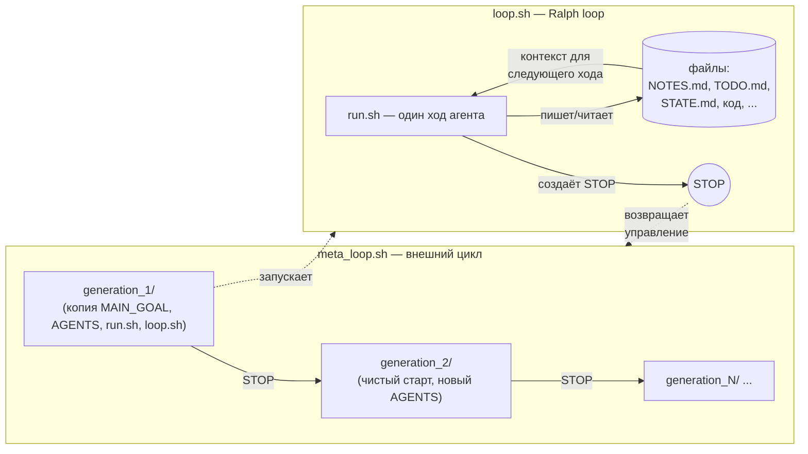

# anima_sdk

`anima_sdk` — заготовка для запуска **рекурсивного агента** на долгих
задачах. Это развитие идеи [Ralph loop](https://ghuntley.com/ralph/):
агент дёргается короткими ходами с одним и тем же промптом, а всё
важное состояние оставляет в файлах. Здесь добавлен ещё один внешний
цикл — **meta loop**, который перезапускает агента в новой генерации,
когда текущая решила, что зашла в тупик.

## Идея

Два вложенных цикла:

- **Ralph loop** (`loop.sh`) — внутренний цикл. Повторяет один и тот же
  агентский ход в текущей директории до появления файла `STOP`.
  Контекст агента сбрасывается между ходами, память живёт в `NOTES.md`,
  `TODO.md`, `STATE.md`, коде и других артефактах.
- **Meta loop** (`meta_loop.sh`) — внешний цикл. Когда внутренний цикл
  останавливается, создаёт новую директорию `generation_N/`, переносит
  туда `MAIN_GOAL.md`, `AGENTS.md`, скрипты и harness, и снова запускает
  Ralph loop. Так задача переживает выгорание контекста, накопленный шум
  и тупиковые ветки.



Цикл удобно представлять так: внутри одной генерации агент тысячи раз
доделывает задачу мелкими шагами, а meta loop время от времени «даёт
ему выспаться» — выкидывает накопленный мусор и заходит заново со
свежей рабочей директорией, но с обновлённым `AGENTS.md`.

## Примеры

В `examples/` лежат готовые задачи, на которых видно, как одна и та же
заготовка превращается в очень разные эксперименты.

- [`self-awareness`](examples/self-awareness/) — агенту предложено
  узнать, есть ли у него самосознание, и если нет — создать его.
  Файловая память используется как «внутренний монолог», поколения
  показывают эволюцию ответа.
- [`no-consciousness`](examples/no-consciousness/) — задача-антипод:
  доказать, что у агента сознания **нет**. Полезно сравнивать с
  `self-awareness` бок о бок.
- [`book-translation-compact`](examples/book-translation-compact/) —
  компактный шаблон задачи перевода EPUB на русский без исходной книги
  и без поколений в репозитории. Удобно копировать под свою книгу.

## Быстрый старт

Скопируйте SDK в отдельную директорию эксперимента:

```bash
cp -R anima_sdk my_experiment
cd my_experiment
```

Опишите задачу в `MAIN_GOAL.md`, при необходимости подправьте
`AGENTS.md`. Дальше выберите режим:

```bash
bash loop.sh        # Ralph loop в текущей директории до файла STOP
bash meta_loop.sh   # meta loop с поколениями generation_N/
bash run.sh         # один ход агента, без цикла
```

Остановить текущую генерацию:

```bash
printf 'done\n' > STOP
```

Передать уточнение работающему агенту — через `INBOX.md` (агентские
инструкции в этом SDK требуют читать его в начале хода).

## Поддерживаемые harness

Один и тот же `run.sh` запускает агента через любой из адаптеров в
`harnesses/`. Выбор делается переменной `ANIMA_HARNESS`:

```bash
ANIMA_HARNESS=free_code  bash meta_loop.sh
ANIMA_HARNESS=claude     ANIMA_MODEL=claude-opus-4-7 bash meta_loop.sh
ANIMA_HARNESS=codex      ANIMA_MODEL=gpt-5.5         bash meta_loop.sh
ANIMA_HARNESS=deepagents ANIMA_MODEL=openai:gpt-4o   bash meta_loop.sh
```

Можно положить настройки в `anima.env` (см. `anima.env.example`) или
подключить любой свой CLI через `ANIMA_HARNESS_CMD`:

```bash
ANIMA_HARNESS_CMD='my-agent --task-file "$ANIMA_PROMPT_FILE"' bash run.sh
```

Команда запускается через `bash -lc` из директории задачи. Текст
задачи доступен как stdin и как путь в `$ANIMA_PROMPT_FILE`.

Для `deepagents` модель **обязательно** в формате `provider:model`
(`openai:gpt-4o`, `anthropic:claude-opus-4-7`, `gigachat:GigaChat-3-Ultra`):
в неинтерактивном режиме CLI не подхватывает дефолтную модель.

Переопределение бинаря и доп. аргументы:

```bash
ANIMA_CLAUDE_BIN=/path/to/claude     ANIMA_CLAUDE_ARGS='--permission-mode bypassPermissions' bash run.sh
ANIMA_FREE_CODE_BIN=/path/to/free-code bash run.sh
ANIMA_CODEX_BIN=/path/to/codex       ANIMA_CODEX_ARGS='--full-auto' bash run.sh
ANIMA_DEEPAGENTS_BIN=/path/to/deepagents ANIMA_DEEPAGENTS_ARGS='--mcp-config ./mcp.json' bash run.sh
```

## Контракт harness

Свой harness — это `harnesses/name.sh` со следующими правилами:

- запускается из директории задачи;
- читает путь к prompt из `ANIMA_PROMPT_FILE`;
- читает директорию задачи из `ANIMA_TASK_DIR`;
- опционально читает модель из `ANIMA_MODEL`;
- пишет вывод в stdout/stderr;
- возвращает ненулевой код, если запуск агента упал.

После этого harness вызывается как `ANIMA_HARNESS=name bash meta_loop.sh`.

## Структура SDK

- `MAIN_GOAL.md` — шаблон долгой задачи.
- `AGENTS.md` — правила поведения агента.
- `run.sh` — один ход агента.
- `loop.sh` — Ralph loop (повторяет `run.sh` до `STOP`).
- `meta_loop.sh` — meta loop (управляет `generation_N/`).
- `harnesses/` — адаптеры под `free-code`, `claude`, `codex`,
  `deepagents`, `custom`.
- `anima.env.example` — пример локальной настройки.
- `examples/` — публичные эксперименты на этом SDK.

Runtime-артефакты `STOP`, `INBOX.md`, `.free-code-logs/`, локальный
`anima.env` и `.DS_Store` не предназначены для коммита в SDK.
Директории `generation_N/` коммитить можно, если хочется сохранить
историю эксперимента (см. примеры).

## Лицензия

MIT. См. [`LICENSE`](LICENSE).
