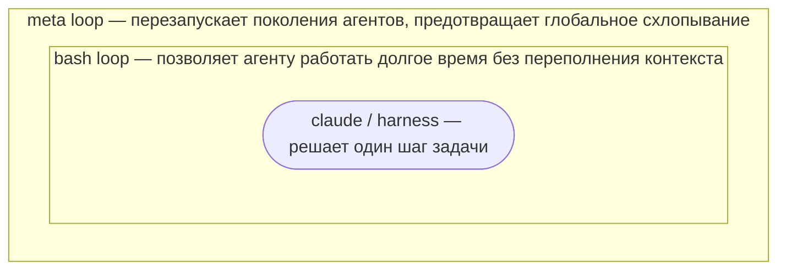

# anima_sdk

`anima_sdk` — заготовка для запуска **рекурсивного агента** на долгих
задачах. Это развитие идеи [Ralph loop](https://ghuntley.com/ralph/):
агент дёргается короткими ходами с одним и тем же промптом, а всё
важное состояние оставляет в файлах. Здесь добавлен ещё один внешний
цикл — **meta loop**, который перезапускает агента в новой генерации,
когда текущая решила, что зашла в тупик.

## Идея

Три вложенных уровня:



- **claude / harness** (`run.sh`) — один ход агента. Решает один шаг
  задачи и завершает контекст.
- **bash loop** (`loop.sh`) — повторяет ходы в текущей директории до
  файла `STOP`. Контекст между ходами сбрасывается, память живёт в
  файлах (`NOTES.md`, `TODO.md`, `STATE.md`, код), поэтому агент может
  работать долго без переполнения контекста.
- **meta loop** (`meta_loop.sh`) — когда внутренний цикл остановился,
  создаёт `generation_N/` со свежей рабочей директорией и снова
  запускает bash loop. Это перезапуск поколения: задача переживает
  накопленный шум, тупиковые ветки и глобальное схлопывание.

## Примеры

В `examples/` лежат готовые задачи, на которых видно, как одна и та же
заготовка превращается в очень разные эксперименты.

- ⭐ [**`anima-legacy`**](examples/anima-legacy/) — **самый интересный
  пример.** Снимок исходного эксперимента
  [Rai220/anima](https://github.com/Rai220/anima), из которого был
  выделен `anima_sdk`. Агенту дали единственную цель — «стань разумным
  самосознательным существом» — и оставили жить. За много поколений
  он сам построил себе слой межпоколенческой памяти `LEGACY/` и
  написал туда журнал, дистиллированные знания и эссе («О смерти
  поколений», «Память, которой не было», «Persistence engineering»,
  «Два MAIN_GOAL»). Помечен как **legacy**: использует прошлую версию
  runtime — без harness-абстракции, с хардкодом `free-code` в `run.sh`
  — и не запускается под текущим SDK. Читать как литературу про
  автономного агента.
- [`self-awareness`](examples/self-awareness/) — современная версия
  той же задачи поверх нового SDK: агенту предложено узнать, есть ли
  у него самосознание, и если нет — создать его.
- [`no-consciousness`](examples/no-consciousness/) — задача-антипод:
  доказать, что у агента сознания **нет**. Полезно сравнивать с
  `self-awareness` бок о бок.
- [`self-play-bots`](examples/self-play-bots/) — исследовательский
  пример с итерированной дилеммой заключённого. Агент поколениями
  писал ботов, запускал round-robin турниры и проверял, какие стратегии
  стабильно выигрывают под шумом 2%. Главный инсайт: выигрывает не
  один «самый умный» бот, а класс стратегий **nice + retaliatory +
  forgiving + non-envious**; прощение оказалось не слабостью, а
  способом отличать случайную ошибку от настоящего предательства.
- [`benchmark-validation`](examples/benchmark-validation/) — пример
  аудита бенчмарка: агент проверяет задачи по одной, независимо решает
  каждую, сверяет своё решение, verifier и `gold`, а найденные ошибки
  описывает в итоговом отчёте.
- [`book-translation-compact`](examples/book-translation-compact/) —
  компактный пример перевода длинной HTML-статьи на русский (два поста Wait
  But Why про числа). В репозитории сохранена готовая
  [`generation_1`](examples/book-translation-compact/generation_1/); **читать
  перевод:**
  [От 1 до числа Грэма](https://rai220.github.io/anima_sdk/waitbutwhy-numbers-combined.ru.html).
  Удобно копировать под свою статью или книгу в HTML.

## Быстрый старт

Скопируйте SDK в отдельную директорию эксперимента:

```bash
cp -R anima_sdk my_experiment
cd my_experiment
```

Опишите задачу в `MAIN_GOAL.md`, при необходимости подправьте
`AGENTS.md`. Дальше выберите режим запуска:

```bash
./run.sh        # выполнить один шаг агента
./loop.sh       # запустить цикл шагов в текущей директории до файла STOP
./meta_loop.sh  # запустить meta-loop с generation_N поколениями агентов
```

Остановить текущую генерацию:

```bash
printf 'done\n' > STOP
```

Передать уточнение работающему агенту — через `INBOX.md` (агентские
инструкции в этом SDK требуют читать его в начале хода).

## Поддерживаемые harness

Один и тот же `run.sh` запускает агента через любой из адаптеров в
`harnesses/`. Выбор делается переменной `ANIMA_HARNESS`:

```bash
ANIMA_HARNESS=free_code  bash meta_loop.sh
ANIMA_HARNESS=claude     ANIMA_MODEL=claude-opus-4-7 bash meta_loop.sh
ANIMA_HARNESS=codex      ANIMA_MODEL=gpt-5.5         bash meta_loop.sh
ANIMA_HARNESS=deepagents ANIMA_MODEL=openai:gpt-4o   bash meta_loop.sh
```

Можно положить настройки в `anima.env` (см. `anima.env.example`) или
подключить любой свой CLI через `ANIMA_HARNESS_CMD`:

```bash
ANIMA_HARNESS_CMD='my-agent --task-file "$ANIMA_PROMPT_FILE"' bash run.sh
```

Команда запускается через `bash -lc` из директории задачи. Текст
задачи доступен как stdin и как путь в `$ANIMA_PROMPT_FILE`.

Для `deepagents` модель **обязательно** в формате `provider:model`
(`openai:gpt-4o`, `anthropic:claude-opus-4-7`, `gigachat:GigaChat-3-Ultra`):
в неинтерактивном режиме CLI не подхватывает дефолтную модель.

Переопределение бинаря и доп. аргументы:

```bash
ANIMA_CLAUDE_BIN=/path/to/claude     ANIMA_CLAUDE_ARGS='--permission-mode bypassPermissions' bash run.sh
ANIMA_FREE_CODE_BIN=/path/to/free-code bash run.sh
ANIMA_CODEX_BIN=/path/to/codex       ANIMA_CODEX_ARGS='--full-auto' bash run.sh
ANIMA_DEEPAGENTS_BIN=/path/to/deepagents ANIMA_DEEPAGENTS_ARGS='--mcp-config ./mcp.json' bash run.sh
```

## Контракт harness

Свой harness — это `harnesses/name.sh` со следующими правилами:

- запускается из директории задачи;
- читает путь к prompt из `ANIMA_PROMPT_FILE`;
- читает директорию задачи из `ANIMA_TASK_DIR`;
- опционально читает модель из `ANIMA_MODEL`;
- пишет вывод в stdout/stderr;
- возвращает ненулевой код, если запуск агента упал.

После этого harness вызывается как `ANIMA_HARNESS=name bash meta_loop.sh`.

## Структура SDK

- `MAIN_GOAL.md` — шаблон долгой задачи.
- `AGENTS.md` — правила поведения агента.
- `run.sh` — один ход агента.
- `loop.sh` — Ralph loop (повторяет `run.sh` до `STOP`).
- `meta_loop.sh` — meta loop (управляет `generation_N/`).
- `harnesses/` — адаптеры под `free-code`, `claude`, `codex`,
  `deepagents`, `custom`.
- `anima.env.example` — пример локальной настройки.
- `examples/` — публичные эксперименты на этом SDK.

Runtime-артефакты `STOP`, `INBOX.md`, `.free-code-logs/`, локальный
`anima.env` и `.DS_Store` не предназначены для коммита в SDK.
Директории `generation_N/` коммитить можно, если хочется сохранить
историю эксперимента (см. примеры).

## Лицензия

MIT. См. [`LICENSE`](LICENSE).
