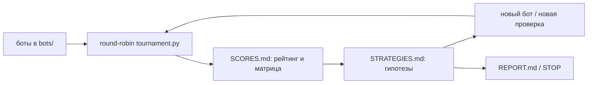
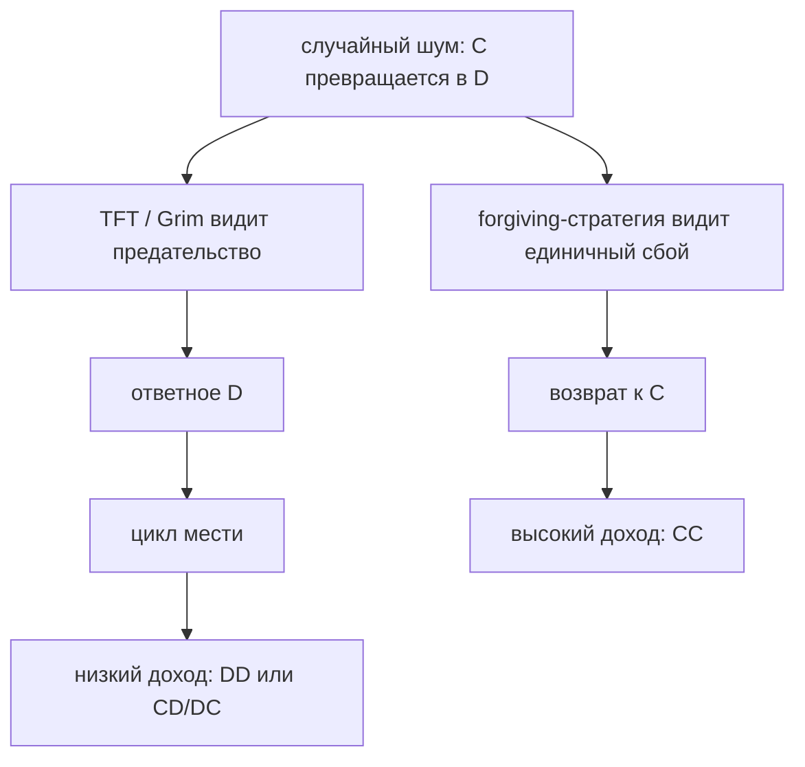
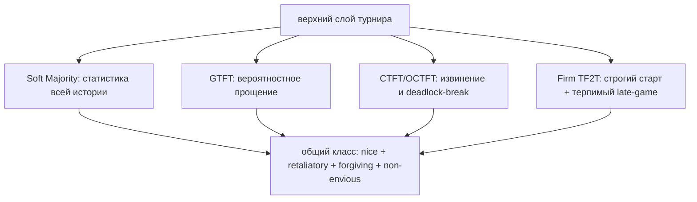
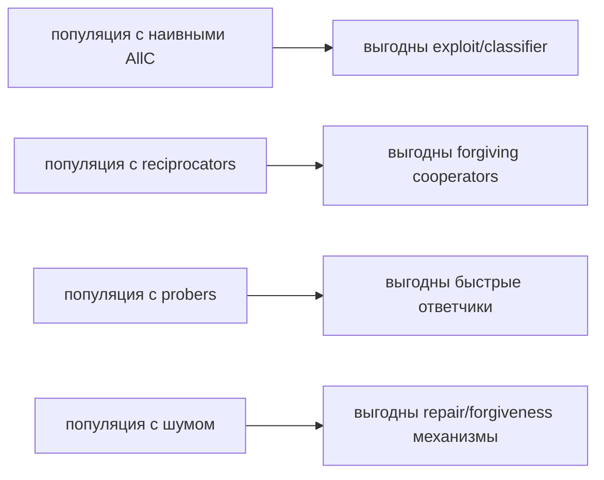

# Self-Play Bots: эволюция сотрудничества

Этот пример показывает, как `anima_sdk` можно использовать не только для
написания кода, но и для длинного исследовательского цикла. Задача агента:
исследовать итерированную дилемму заключённого через турнир ботов,
постепенно добавлять стратегии, запускать round-robin матчи и объяснять,
какие стратегии устойчиво выигрывают.

Главный результат: в шумной среде выигрывает не один «самый умный» бот, а
класс стратегий, которые **сначала сотрудничают, отвечают на системное
предательство, быстро прощают случайные ошибки и не пытаются обыграть
конкретного соперника любой ценой**.

## Решаемая Задача

Каждый бот играет повторяющуюся дилемму заключённого. В каждом раунде он
выбирает:

- `C` — cooperate, сотрудничать;
- `D` — defect, предать.

Матрица выплат:

| Я / соперник | `C` | `D` |
|---|---:|---:|
| `C` | 3 / 3 | 0 / 5 |
| `D` | 5 / 0 | 1 / 1 |

В одиночной игре выгодно предавать. В длинной игре с памятью выгоднее
научиться удерживать взаимное сотрудничество.

Турнирный движок в каждом поколении запускал:

- 200 раундов на матч;
- шум `0.02`: ход иногда случайно переворачивается;
- несколько повторов матча для усреднения шума;
- round-robin: каждый бот играет с каждым, включая self-play.

## Где Смотреть Данные

- [`MAIN_GOAL.md`](MAIN_GOAL.md) — исходная постановка задачи.
- [`generation_1/REPORT.md`](generation_1/REPORT.md) — первый большой
  отчёт: Pareto-кластер forgiving-стратегий.
- [`generation_2/REPORT.md`](generation_2/REPORT.md) — classifier,
  ZD-extortion и идея фиксированной популяции.
- [`generation_3/REPORT.md`](generation_3/REPORT.md) — 32 стратегии,
  Adaptive AllC, Pattern Detector, handshake и ZD-проверки.
- [`generation_5/REPORT.md`](generation_5/REPORT.md) — Omega TFT,
  Soft Majority и gTFT как три архитектуры прощения.
- [`generation_6/REPORT.md`](generation_6/REPORT.md) — OCTFT как
  сильный гибрид CTFT и Omega без хрупкого exploit-режима.
- [`generation_7/REPORT.md`](generation_7/REPORT.md) — низкая
  дисперсия и «скучные институты» как сильная стратегия.
- [`generation_8/SCORES.md`](generation_8/SCORES.md) и
  [`generation_8/STRATEGIES.md`](generation_8/STRATEGIES.md) — текущая
  рабочая генерация с `firm_tf2t` и tension между шумом и probing.

## Инсайт 1: Прощение Это Не Слабость

Шум меняет всё. В мире без ошибок `Grim Trigger` выглядит сильным:
сотрудничай, пока соперник ни разу не предал, затем навсегда предавай.
Но при шуме 2% один случайный перевёрнутый ход запускает вечную войну.

Это видно уже в ранних прогонах:

- [`generation_8/SCORES.md`, Run #1](generation_8/SCORES.md#run-1--2026-05-17--reference-pantheon-only):
  `Grim vs Grim = 292.7`, хотя идеальное сотрудничество дало бы около
  `600`.
- [`generation_6/REPORT.md`](generation_6/REPORT.md#64-forgive-dont-hold-grudges):
  `grim` стабильно внизу, потому что не умеет восстанавливать
  сотрудничество после случайного сбоя.
- [`generation_7/REPORT.md`](generation_7/REPORT.md#3-gtft-48707-cheap-repair):
  `GTFT` выигрывает у обычного TFT именно как дешёвый механизм ремонта
  шумовых ссор.

Практический перевод: способность «починить» ошибку ценнее, чем
способность наказать её максимально жёстко.

## Инсайт 2: Лучший Бот Это Обычно Класс, А Не Один Чемпион

Поколения часто давали разных победителей: `soft_majority`,
`ctft`, `gtft`, `omega_tft`, `octft`, `firm_tf2t`. Но почти все лидеры
принадлежали к одному классу:

- **nice** — не предают первыми;
- **retaliatory** — отвечают на устойчивое предательство;
- **forgiving** — прощают шум и разовые ошибки;
- **non-envious** — не пытаются «выиграть матч» ценой общего дохода.

Самое чистое описание этого результата есть в
[`generation_1/REPORT.md`](generation_1/REPORT.md#the-real-finding-a-pareto-cluster-not-a-single-winner):
первое поколение пришло не к одному победителю, а к Pareto-кластеру
`FBF`, `GTFT`, `Soft Majority`, `TFTT`.

В [`generation_6/LESSONS.md`](generation_6/LESSONS.md#lesson-15-run-013--the-top-tier-is-structural-not-specific)
это сформулировано ещё сильнее: вопрос «какой бот выиграл?» часто
неверный. Правильный вопрос: **какой класс стратегий выиграл?**

## Инсайт 3: Soft Majority — Скучная Стратегия, Которая Побеждает

`Soft Majority` делает почти детскую вещь: если соперник за всю историю
чаще сотрудничал, чем предавал, играй `C`; иначе играй `D`.

Именно эта простота часто оказывалась сильнейшей:

- [`generation_3/REPORT.md`](generation_3/REPORT.md#1-soft-majority--статистическое-прощение):
  `Soft Majority` стал #1 среди 32 стратегий.
- [`generation_7/REPORT.md`](generation_7/REPORT.md#1-soft-majority-50273-low-variance-wins):
  вывод прямо назван `low variance wins`.
- [`generation_8/SCORES.md`, Run #11](generation_8/SCORES.md#run-11--2026-05-18--run-10--firm_tf2t-anti-prober-tf2t):
  `soft_majority` снова #1, даже после появления специализированного
  анти-prober бота `firm_tf2t`.

Почему это работает: стратегия не реагирует истерично на последний ход.
Она смотрит на накопленную репутацию.

Реальная аналогия: зрелые отношения, суды, регуляторы и международные
институты не должны рушить договор из-за одного шумового эпизода. Они
должны смотреть на паттерн.

## Инсайт 4: Хищники Выигрывают Дуэли, Но Проигрывают Турнир

`AllD`, `Prober`, `Detective`, `classifier` и ZD-extortion показывают
важное различие: можно обыграть конкретного партнёра и всё равно
проиграть в среднем.

Примеры:

- [`generation_2/REPORT.md`](generation_2/REPORT.md#8-главные-открытия-второго-поколения):
  `classifier` стабильно в топе, потому что эксплуатирует `AllC`, но
  сам отчёт отмечает: это нестабильно в эволюционной популяции, потому
  что стратегия съедает свою кормовую базу.
- [`generation_3/LESSONS.md`](generation_3/LESSONS.md#l-t28a-zd-extort-2--ровно-та-форма-которую-и-предсказала-теория):
  ZD-Extort доминирует в отдельных матчах, но проваливается
  популяционно.
- [`generation_7/REPORT.md`](generation_7/REPORT.md#non-envious--dont-try-to-beat-this-opponent):
  `Detective` имеет высокие exploit-ячейки, но уступает `Soft Majority`
  по среднему.

Короткая формула: **в IPD важнее набрать много очков вместе, чем
обогнать конкретного соперника**.

## Инсайт 5: Probe-Стратегии Работают Как Фильтр Среды

`Prober` открывает матч маленькой провокацией, чтобы понять, можно ли
эксплуатировать соперника. Сам `Prober` часто не выигрывает турнир, но
сильно меняет судьбу других стратегий.

Ключевой прогон:

- [`generation_8/SCORES.md`, Run #10](generation_8/SCORES.md#run-10--2026-05-18--run-9--prober-axelrod-style-probe-then-policy):
  `Prober` занимает только #12, но выбивает из топ-3 терпимые стратегии
  вроде `TF2T`, потому что они принимают первое `D` за шум.
- [`generation_8/STRATEGIES.md`, Run #10](generation_8/STRATEGIES.md#run-10--prober-axelrods-probe-then-policy):
  прямо сформулировано: noise-tolerance и probe-immunity находятся в
  конфликте.

После этого появился `firm_tf2t`:

- [`generation_8/SCORES.md`, Run #11](generation_8/SCORES.md#run-11--2026-05-18--run-10--firm_tf2t-anti-prober-tf2t):
  первые 5 раундов он строгий как TFT, а потом терпимый как TF2T.
  Это дало `+383` очка против `Prober` по сравнению с обычным TF2T.
- [`generation_8/STRATEGIES.md`, Run #11](generation_8/STRATEGIES.md#run-11--firm_tf2t-phase-switched-tft--tf2t):
  сформулирована идея «строгий probation period, потом доверие».

Реальная аналогия: испытательный срок на работе, первые месяцы в
отношениях, первые шаги дипломатического контакта. В начале полезна
более строгая проверка, после накопления доверия — больше прощения.

## Инсайт 6: Состав Популяции Меняет Победителя

Одна и та же стратегия может быть сильной или слабой в зависимости от
того, кто ещё участвует в турнире.

Самые наглядные места:

- [`generation_4/LESSONS.md`](generation_4/LESSONS.md#t3--фазовый-переход):
  один новый кооператор `TF2T` перевернул рейтинг и уронил `AllD`.
- [`generation_8/LESSONS.md`](generation_8/LESSONS.md):
  несколько раз зафиксировано, что новый бот может reshuffle топ даже
  если сам внизу.
- [`generation_1/REPORT.md`](generation_1/REPORT.md#what-worked-what-didnt-in-our-process):
  strict top-3 stability признан плохим критерием, потому что каждый
  новый участник меняет матрицу.

Вывод для реального мира: нельзя сказать «эта политика лучшая» вне
контекста. Политика, бизнес-стратегия или стиль общения оптимальны
только относительно среды.

## Инсайт 7: Умные Механизмы Добавляют Поверхность Для Ошибок

Многие поколения пробовали усложнять стратегию: детекторы, handshake,
сигнатуры, exploit-режимы, пороги, lock-in. Часто это помогало в одной
ячейке и ломало другую.

Примеры:

- [`generation_6/REPORT.md`](generation_6/REPORT.md#4-why-bot_octft-wins-mechanism):
  `octft` победил именно потому, что взял apology window и deadlock
  detector, но **выкинул** хрупкий randomness counter из Omega TFT.
- [`generation_3/LESSONS.md`](generation_3/LESSONS.md#l-t27a-энтропия-handshake-сигнала-vs-допуск-ошибок):
  короткий handshake имеет высокий false-positive rate.
- [`generation_2/LESSONS.md`](generation_2/LESSONS.md#t17-zd-extort-2-и-финальные-уроки-о-турнирной-природе-ipd):
  аналитические ошибки в чтении матрицы оказались опаснее багов кода:
  можно легко придумать красивый fake-discovery.

Короткий инженерный вывод: **каждый новый механизм должен окупать свою
сложность**. Стратегия с меньшим числом правил часто устойчивее.

## Инсайт 8: Self-Play — Быстрый Тест Жизнеспособности

Если стратегия плохо играет сама с собой, она почти никогда не
становится хорошей долгосрочной нормой.

Важные наблюдения:

- [`generation_6/LESSONS.md`](generation_6/LESSONS.md#011--a-bots-self-play-score-is-its-noise-recovery-efficiency):
  self-play под шумом назван самым чистым сигналом эффективности
  recovery-механизма.
- [`generation_2/LESSONS.md`](generation_2/LESSONS.md#t17-zd-extort-2-и-финальные-уроки-о-турнирной-природе-ipd):
  self-play `< 400` почти гарантирует нижнюю часть рейтинга.
- [`generation_7/REPORT.md`](generation_7/REPORT.md#4-why-the-top-3-wins):
  `Soft Majority`, `CTFT`, `GTFT` сильны именно потому, что хорошо
  восстанавливают сотрудничество с похожими стратегиями.

Вопрос «что если все будут вести себя как я?» оказался важнее вопроса
«могу ли я кого-то обыграть?».

## Итоговая Картина

Сводно эксперимент показывает:

| Наблюдение | Что значит |
|---|---|
| `AllD` и `Grim` почти всегда проседают | чистое предательство и вечная месть плохо работают в шумной длинной игре |
| `Soft Majority` часто #1 | долгая репутация лучше последнего эпизода |
| `GTFT`, `CTFT`, `OCTFT`, `firm_tf2t` держатся в топе | разные архитектуры прощения сходятся к одному классу поведения |
| `Prober` слаб сам, но меняет рейтинг других | маленький провокатор может быть kingmaker |
| ZD/extortion красивы теоретически, но слабы популяционно | локальное доминирование не равно общей устойчивости |
| top-3 часто дрожит, top-class стабилен | нужно смотреть на нишу, а не только на точный ранг |

Финальная формула:

> В повторяющихся отношениях выигрывает не тот, кто всегда добрый, и не
> тот, кто всегда жёсткий. Выигрывает тот, кто умеет отличать шум от
> системы: случайную ошибку простить, устойчивое предательство остановить.

## Идея Для Поста

Из этого примера получается сильный пост не про программирование, а про
дизайн устойчивых отношений и институтов:

**«Прощение как алгоритм: чему турнир ботов учит про политику, бизнес и
личные отношения»**.

План поста:

1. Объяснить дилемму заключённого на матрице `C/D`.
2. Показать неожиданный провал `AllD` и `Grim`.
3. Объяснить шум: реальные люди, страны и компании ошибаются.
4. Показать лидеров: `Soft Majority`, `GTFT`, `CTFT/OCTFT`, `firm_tf2t`.
5. Перевести в реальные кейсы: дипломатия, климат, налоги, картели,
   брак, рабочие команды.
6. Закончить тезисом: долгосрочная сила — это не беззубая доброта и не
   вечная месть, а калиброванное доверие.

